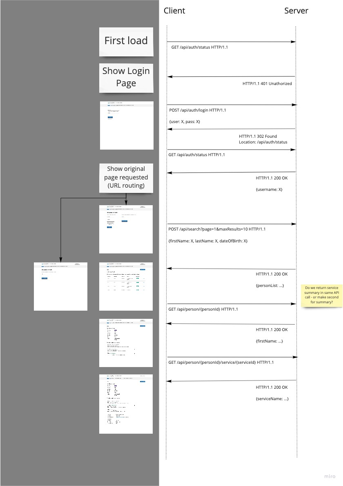

# Family Context API and Reference Implementation

Family Context is a tool that allows social workers to easily access ​
service involvement information on relevant individuals ​
in order to then facilitate conversations with lead practitioners. ​

We want to ensure that social workers always have the information they need so that:​
- More young people are well looked after by their families and fewer end up in care​
- Children are protected from harm even when no single service perceives significant risk​
- Social workers are viewed by all families as people who really understand their circumstances and can support them

This project is a partnership between [Stockport Metropolitan Borough Council](https://www.stockport.gov.uk/), 
[Leeds City Council](https://www.leeds.gov.uk/), [Social Finance](https://www.socialfinance.org.uk/) 
and [MHCLG](https://gov.uk/mhclg)’s [Local Digital Collaboration Unit​](https://localdigital.gov.uk/).

The project is funded by MHCLG’s Local Digital Fund and the Christie Foundation – both funders are focused on 
supporting local authorities to create common solutions to shared problems.

The project supports working in the open, and the project status can be followed on the Local Gov Digital 
[Pipeline Tool](https://pipeline.localgov.digital/wiki/277). Outputs from 
[Discovery](https://github.com/CSCDP/Family-Context-Discovery) and 
[Alpha](https://github.com/CSCDP/Family-Context-Alpha) are available on GitHub.

The purpose of this repository is to co-develop the service API for the tool in the open so that all 
participants can have an early input into the design. This includes both project partners, and other 
interested parties. Contributions are welcome. Please contact [kws](https://github.com/kws) for more 
details until we complete contributor information.

## Application Overview

An up-to-date build of the application is maintained on Heroku: 
https://family-context-api.herokuapp.com - the application mimics the authentication flow, but
no password is required to log in. Any string instead of an email will be accepted. The deploy
also includes an interactive API explorer https://family-context-api.herokuapp.com/ui/

An Excel export of the API Schema objects cant be found in 
https://family-context-api.herokuapp.com/family-context-api.xlsx

The data comes from the static data provided in [./server/data/*.csv](./server/data/).

A slightly out-of-date Message Sequence Chart of the application flow:




## Repository Layout

The Family Context project aims to support multiple local authorities, with different requirements around
infrastructure, datasources and reporting tools. The reference application provides a baseline set of functionality
that children's services departments can either build-upon or use as an input into their own development process. 

The API is designed to follow the recommended user journeys identified in the earlier phases of the project, 
and implement sensible data and security boundaries.

The Family Context API is documented using [Open](https://swagger.io/docs/specification/about/) API 
with a reference implementation generated using [Swagger Codegen](https://github.com/swagger-api/swagger-codegen)
combined with a basic [Flask](https://palletsprojects.com/p/flask/) application. 
A [React](https://reactjs.org/) sample UI is also provided for reference although this does
not attempt to match the recommended styles, but only to reproduce the key flows and illustrate API usage.

The reference version for this schema is available in 
[schema/family-context-api.yaml](./schema/family-context-api.yaml). 

After making changes to this file, it is important to re-generate the server and client stubs. 

### Re-generating server and client stubs

We use Swagger Codegen to implement Python and JavaScript versions of the API. The simplest way to do
this is to use the dockerised version of Swagger Codegen. Make sure you have Swagger running, then
run `make clean` followed by `make`. 

Alternatively, you can run the docker commands in the Makefile individually.  For example, you can re-generate the server by running 

```
server/swagger_server/swagger/swagger.yaml: schema/family-context-api.yaml
	rm -rf build/python
	docker run --rm -v ${PWD}:/local swaggerapi/swagger-codegen-cli-v3:3.0.15 generate \
		-i /local/schema/family-context-api.yaml \
		-l python-flask \
		-o /local/build/python/
	rsync -avP --delete build/python/swagger_server server/.
 ```

## Build 

The simplest way to build and run the entire application is using Docker. Simply run

```
$ docker build . -t family-context-api 

$ docker run -it -p8080:8080 family-context-api 
```

You can then access the API specification on

http://localhost:8080/ui/

and the reference UI on

http://localhost:8080


### Deploying
 
Our reference application is deployed on Heroku to https://family-context-api.herokuapp.com

To run your own version of this, make sure you configure Heroku to deploy Docker images. 

```
heroku apps:create <appname>
heroku git:remote --app <appname>
heroku stack:set container
git push heroku master
```
